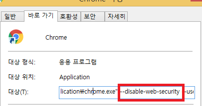

안녕하세요
Ajax 요청 시 크로스 도메인 이슈 수정한 내용 공유 드립니다.
크로스 도메인 이슈는 우리 web app을 실행한 도메인과 다른 도메인에 요청해서 데이터를 가져오는 경우, 
동일한 도메인 내에서만 데이터를 요청해야 하는 보안정책에 걸려서 발생합니다.

이슈 : 아래 로그 발생하면서, Ajax요청이 안됨.
XMLHttpRequest cannot load https://cloud-ev.dsr-company.com/srv/api.
No 'Access-Control-Allow-Origin' header is present on the requested resource.
Origin 'https://cloud-ev.dsr-company.com/srv/api’ is therefore not allowed access.

1.	서버로부터 오는 Response Header에 Access-Control-Allow-Origin 이 포함되어 있는지 확인.
    Access-Control-Allow-Origin 의미는 서버에서 크로스 사이트 요청을 허용하는 의미
    없으면 서버단에 요청해서 넣어달라고 합니다.

2.	서버단을 수정할 수 없는 경우라면, Browser팀에 요청해서 Browser 세팅에서 크로스도메인 정책을 해제해달라고 합니다.

그 밖에 jsonp(GET방식), 프록시서버를 이용하는 방법도 있는데, jsonp방식도 서버에서 처리가 안 되어 있으면 사용 못하고, 프록시 서버를 만들기는 어려울 것 같습니다.
일반적으로 크로스도메인 이슈는 대부분 위의 1번방법으로 해결한다고 합니다.
이번에도 1번 방법으로 해결했습니다.
