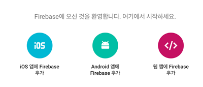
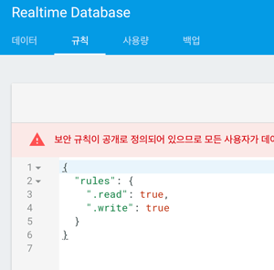
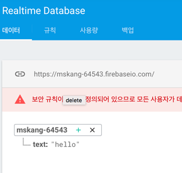

# Firebase Realtime Database 사용하기

*** 

#### Firebase Realtime DB를 사용하기 위해 Firebase에 만들어 놓은 Web프로젝트를 선택하고, 웹앱에 Firebase추가 버튼을 누른다.

.

#### 버튼을 누르면 코드 스니펫이 나오는데 이것을 복사하여 Web App 코드에 붙여넣는다.

 - 코드안에 Firebase 서비스 이용에 필요한 정보들도 들어있다.

        
        

.

#### 이제 Firebase의 Database탭을 선택하고, 규칙을 모두 true로 바꿔준다.

.

#### Data를 입력한다.

.

#### 마지막으로 아래와 같이 Web App에 코드를 넣으면 Database의 text값이 변경될 때마다 alert가 발생하고, 변경된 값을 보여준다.  

    ...
    firebase.initializeApp(config);
    
    var dbRef = firebase.database().ref().child('text');
    dbRef.on('value', snap => alert(snap.val()));
    
. 
         
***         
         
### 참조

 - Getting Started with Firebase on the Web
 
   <https://www.youtube.com/watch?v=k1D0_wFlXgo&list=PLl-K7zZEsYLmnJ_FpMOZgyg6XcIGBu2OX>